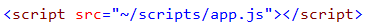
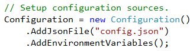
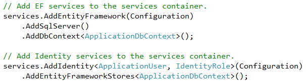

<properties
	pageTitle="C# / ASP.NET"
	_description="ASP.NET is a free, open source web framework for building great Web sites and Web applications using HTML, CSS and JavaScript."
	description="ASP.NET は HTML、CSS、JavaScript を利用して素晴らしい Web サイトや Web アプリケーションを構築するための無料でオープンソースな Web フレームワークです。"
	slug="aspnet"
    order="100"
	keywords="c#, asp.net, roslyn, server-side, mvc, webforms, web forms, webpages, web pages"
/>

## Open Source
<!--
Found a bug or got a new idea? Open an issue or send a pull request. 
All of the ASP.NET and .NET Core CLR runtime components as well the Azure SDKs 
for any language are all on GitHub and taking contributions. Get involved today! 
-->

バグを見つけたり、新しいアイデアを思いつきましたか? Issue を立てたり、pull request を送ってください。
すべての ASP.NET と .NET Core CLR ランタイムコンポーネントと、様々な言語のための Azure SDK は
すべて GitHub にあり、コントリビューションを受け付けています。ぜひ参加してください!

<!--
It's all on [GitHub](https://github.com/aspnet/home/)
and pull requests are more than welcome.
-->

全部 [GitHub](https://github.com/aspnet/home/) にあるので pull request は大歓迎です。

## Razor
<!--
The ASP.NET Razor syntax allows you to inline C# directly inside
your views.
-->

ASP.NET Razor 記法はビューの中に C# を直接書き込めるようにします。

<!--
You've got full access to the current `Model` as well
as the entire .NET framework types available.
-->

すべての .NET Framework の型が利用できるのはもちろん、現在の `Model` に完全なアクセスができます。

## Tag Helpers
<!--
coming soon...
-->

[あとで書く]

## Tilde slash
<!--
You can use the tilde (~) character in Razor markup to indicate the root
of the website. This is particularly useful when the root of the application
is located in a subfolder of an existing website.
-->

Razor マークアップにおいて、チルダ (~) 文字は Web サイトのルートを表すために利用できます。
特にアプリケーションが既存の Web サイトのサブフォルダとして置かれている特に役立ちます。

## Model driven development
<!--
The models used in an ASP.NET application can be annotated to provide
a wide range of experiences such as database schema generation,
view scaffolding, client- and server-side validation and more.
-->

ASP.NET アプリケーションにおいて利用されるモデルは注釈をつけることでデータベーススキーマ生成や
ビューのスキャフォールディング、クライアント/サーバーサイドでのバリデーション、などのような幅広い体験を提供します。

### Model annotations
<!--
Annotate your models to generate the database schema and scaffold views.
-->

モデルにデータベーススキーマとビューのスキャフォールドのために注釈をつけることができます。

### Validation
<!--
Annotations will also ensure both server- and client-side validation.
-->

注釈はサーバーおよびクライアントサイドのバリデーションを担保することもできます。

### Scaffolding
<!--
In the works...
-->

[あとで書く]

### Dynamic templating
<!--
coming soon...
-->

[あとで書く]

## Roslyn compiler
<!--
The .NET Compiler Platform ("Roslyn") provides open-source C# and
Visual Basic compilers with rich code analysis APIs.
-->

.NET コンパイラープラットフォーム ("Roslyn") はオープンソースの C# と Visual Basic の高度なコード解析APIを持つコンパイラーです。

<!--
It enables building code analysis tools with the same APIs that are
used by Visual Studio.
-->

Roslyn は Visual Studio が利用しているものと同様の API を利用してコード解析ツールを作ることを可能にします。

## Environment awareness
<!--
The app specific configuration defaults to have environment settings override
the configuration in the projects.
-->

環境設定にあるアプリケーション固有の既定の構成でプロジェクトでの構成を上書きできます。

## Code based configuration
<!--
Any identity, routing and database configuration is code based to give
full fidelity to the logic need for any web app.
-->

ID (Identity)やルーティング、データベースのどんな構成でも、コードベースとなることで
どんな Web アプリケーションにも必要なロジックへの完全な忠実さを提供します。

<aside role="complementary">

## Related resources

<section>

### More information

- [ASP.NET weekly community standup](http://www.youtube.com/playlist?list=PL0M0zPgJ3HSftTAAHttA3JQU4vOjXFquF)
- [ASP.NET on Github](https://github.com/aspnet/home/)
- [Roslyn C# compiler on Github](https://github.com/dotnet/roslyn/)
</section>

<section>

### Relevant extensions

- [Web Essentials](https://visualstudiogallery.msdn.microsoft.com/ee6e6d8c-c837-41fb-886a-6b50ae2d06a2)
- [Cobisi Routing assistant for ASP.NET](https://visualstudiogallery.msdn.microsoft.com/f0589156-a8e6-47db-8bac-90f01ca6b8a3)
</section>

</aside>
