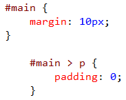

<properties
			pageTitle="CSS"
			_description="The new CSS editor in Visual Studio fully supports all versions of CSS including CSS Selectors Level 4."
			description="Visual Studio の新しい CSS エディタは CSS Selectors Level 4 を含む、すべてのバージョンの CSS を完全にサポートします。"
			slug="css"
			order="400"
			keywords="css, intellisense, stylesheets"
/>

## Auto-completion
<!--
Visual Studio [IntelliSense](http://go.microsoft.com/fwlink/?LinkId=532997) is always up-to-date with the latest web standards. You get accurate hints for classes, IDs and attribute names and values, which can sometimes be hard to remember.
-->

Visual Studio [IntelliSense](http://go.microsoft.com/fwlink/?LinkId=532997) は常に最新の Web 標準に更新されています。クラス、ID、属性名と値を思い出すのが難しい時でも的確なヒントを得ることができます。

## Vendor-specific properties
<!--
Vendor-specific selectors and properties are supported for `-moz-*`, `-ms-*`, `-o-*` and `-webkit-*`.
-->

`-moz-*` や `-ms-*` に `-o-*` と `-webkit-*` といったベンダー固有のセレクターやプロパティをサポートします。

## General snippets
<!--
The comprehensive snippet collection makes it easier to write more complex CSS, like gradients, media queries, font-face embedding, and a lot more.
-->

幅広いスニペットのコレクションはグラデーション、メディアクエリー、font-face 埋め込みといった複雑化する CSS を書くことを簡単にします。

<!--
To invoke a snippet, simply hit the `Tab` key after the property name.
-->

スニペットを呼び出すには、単純に `Tab` キーを押した後にプロパティ名を入力してください。

## Vendor-specific snippets
<!--
All properties that have vendor-specific versions are automatically provided as snippets. Just hit `Tab` to expand the snippet.
-->

ベンダー固有のバージョンを持つすべてのプロパティにスニペットを自動で提供します。スニペットを展開するには `Tab` キーを押すだけです。

## Working with colors
<!--
The color picker is an IntelliSense feature that makes it easy to deal with colors. Use the eyedropper to pick colors from other windows, set the opacity, or choose from previously used colors.
-->

カラーピッカーは IntelliSense 機能であり、色を扱うことを簡単にします。eyedropper を使うことで他のウィンドウから色を拾うことや透明度を設定すること、以前利用した色を選択できます。

## File picker
<!--
Working with images, fonts, and other files is easy using
the built-in file picker that automatically helps you insert file
paths into CSS documents.
-->

画像とフォント、それ以外のファイルを扱うことは、CSS ドキュメントにファイルパスを挿入するのをビルトインのファイルピッカーが自動的に手助けすることで簡単にします。

## Hierarchical indentation
<!--
Keep your CSS file nice and organized using hierarchical indentation. The indentation of the CSS rulesets is based on the cascading order of the selectors. To format the document just press `Ctrl+K+D`.
-->

階層インデントを使うことで CSS ファイルを気持ちよく、まとまった状態を保てます。CSS ルールセットごとのインデントはセレクターのカスケード順が元となります。ドキュメントの書式を整えるには `Ctrl+K+D` を押すだけです。

## Auto-sync with BrowserLink
<!--
coming soon...
-->

[あとで書く]

## Open source
<!--
The entire [CSS language definition](http://schemastore.org/css) that Visual Studio uses is open source. Find a missing property or pseudo-selector? Send a pull request.
-->

Visual Studio が利用している全ての [CSS 言語定義](http://schemastore.org/css) はオープンソースです。足りないプロパティや疑似セレクターを見つけてしまいましたか?是非pull requestを送ってください。