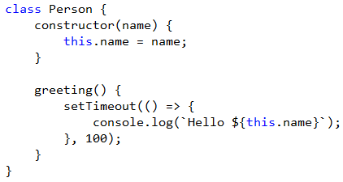

<properties
			pageTitle="JavaScript"
			_description="The JavaScript editor in Visual Studio supports EcmaScript 6 and has the most advanced IntelliSense engine on the market."
			description="Visual Studio の JavaScript エディタは ECMAScript 6 をサポートし、世の中でもっとも進んだ IntelliSense エンジンを備えます。"
			slug="javascript"
			order="300"
			keywords="javascript, jscript, script, dhtml, es3, es5, es6"
/>

## Auto-completion
<!--
The JavaScript [IntelliSense](http://go.microsoft.com/fwlink/?LinkId=532997) engine is powered by Internet Explorer's JavaScript execution engine, Chakra. That means that all your JavaScript code is executed in the background to provide the ultimate IntelliSense experience.
-->

JavaScript [IntelliSense](http://go.microsoft.com/fwlink/?LinkId=532997) エンジンは Internet Explorer の JavaScript 実行エンジン Chakra で動いています。
つまり、素晴らしい IntelliSense の体験を提供するためにあらゆるあなたの JavaScript コードはバックグラウンドで実行されます。

## EcmaScript 6 support
<!--
Visual Studio supports a broad set of EcmaScript 6 features including classes, let, const, fat arrows and template strings.
-->

Visual Studio は幅広い ECMAScript 6 のクラス、let、const、ファットアローやテンプレート文字列といった特徴をサポートします。

## Object literal Intellisense
<!--
The Chakra execution engine is capable of reverse engineering function parameters to provide object literal Intellisense.
-->

Chakra 実行エンジンは関数パラメータをリバースエンジニアリングでき、オブジェクトリテラルの IntelliSense を提供します。

## Snippets
<!--
Snippets provide a shortcut for inserting common structures.
-->

スニペットは共通の構造を挿入するためのショートカットを提供します。

## Go to definition
<!--
Ever needed to find the definition of a variable or function? By pressing `F12` you can easily jump to the definition of any identifier - even across files.
-->

もう変数や関数の定義を探したくないですよね? `F12` キーを押せばどんな識別子の定義でも簡単にジャンプできます。もちろんファイルを超えて。

## JSDoc support
<!--
The IntelliSense engine supports JSDoc v3 as well as the older XMLDoc comment syntax.
-->

IntelliSense エンジンは JSDoc v3 を従来の XMLDoc コメント構文とともにサポートします。

## Debugging
<!--
Set breakpoints, watch locals, and do everything else you would expect from a first-class debugging experience.
-->
ブレークポイントをセットしたり、ローカルをウォッチしたり、一級のデバッグ体験に期待することはなんでもできます。

## Navigation bar
<!--
Easily get an overview of the functions and scopes in any JavaScript file by using the navigation bar at the top of the editor.
-->

エディタの上部にあるナビゲーションバーを利用することで、あらゆる JavaScript ファイルにある関数とスコープの概要を簡単に得られます。

## Unit testing
<!--
Chutzpah (hutz·pah) is an open source JavaScript unit test runner which helps you integrate JavaScript unit testing into your website. It enables you to run JavaScript unit tests from the command line and from inside of Visual Studio.
-->

Chutzpah (hutz pah/フツパー)はオープンソースの JavaScript のユニットテストランナーで、Web サイトに JavaScript ユニットテストを統合するのを助けます。Chutzpah は JavaScript ユニットテストをコマンドラインと Visual Studio の中から実行できるようにします。

<!--
Chutzpah also supports running in the TeamCity continuous integration client, and it supports the QUnit, Jasmine, and Mocha testing frameworks.
-->

Chutzpah は TeamCity の継続的インテグレーションのクライアントでの実行もサポートし、QUnit、Jasmine や Mocha といったテストフレームワークをサポートします。

## Node.js
<!--
Node.js is fully supported. See [other languages](/languages/other/#node.js)
-->

Node.js も完全にサポートされています。[その他の言語](/languages/other/#node.js) を参照してください。

<aside role="complementary">

## Related resources

<section>

### More information

- [JSDoc v3](http://usejsdoc.org/)
- [XMLDoc comments](https://msdn.microsoft.com/en-us/library/bb514138.aspx)
- [Chutzpah on GitHub](https://github.com/mmanela/chutzpah/)
</section>

<section>

### Relevant extensions

- [Web Essentials](https://visualstudiogallery.msdn.microsoft.com/ee6e6d8c-c837-41fb-886a-6b50ae2d06a2)
- [JSLint](https://visualstudiogallery.msdn.microsoft.com/ede12aa8-0f80-4e6f-b15c-7a8b3499370e)
- [DocStubJs](https://visualstudiogallery.msdn.microsoft.com/0cb7304b-ad78-4283-ba2b-42804657fcdd)
- [Download Chutzpah Test Adapter](https://visualstudiogallery.msdn.microsoft.com/f8741f04-bae4-4900-81c7-7c9bfb9ed1fe)
- [Download Chutzpah Context Menu](https://visualstudiogallery.msdn.microsoft.com/71a4e9bd-f660-448f-bd92-f5a65d39b7f0)
</section>

</aside>